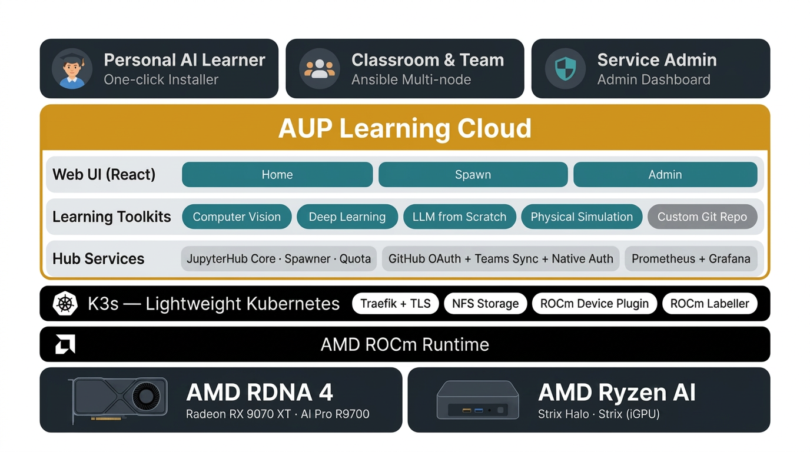

<!-- Copyright (C) 2025 Advanced Micro Devices, Inc. All rights reserved.  Portions of this notebook consist of AI-generated content. -->
<!--
Permission is hereby granted, free of charge, to any person obtaining a copy
of this software and associated documentation files (the "Software"), to deal
in the Software without restriction, including without limitation the rights
to use, copy, modify, merge, publish, distribute, sublicense, and/or sell
copies of the Software, and to permit persons to whom the Software is
furnished to do so, subject to the following conditions:

The above copyright notice and this permission notice shall be included in all
copies or substantial portions of the Software.

THE SOFTWARE IS PROVIDED "AS IS", WITHOUT WARRANTY OF ANY KIND, EXPRESS OR
IMPLIED, INCLUDING BUT NOT LIMITED TO THE WARRANTIES OF MERCHANTABILITY,
FITNESS FOR A PARTICULAR PURPOSE AND NONINFRINGEMENT. IN NO EVENT SHALL THE
AUTHORS OR COPYRIGHT HOLDERS BE LIABLE FOR ANY CLAIM, DAMAGES OR OTHER
LIABILITY, WHETHER IN AN ACTION OF CONTRACT, TORT OR OTHERWISE, ARISING FROM,
OUT OF OR IN CONNECTION WITH THE SOFTWARE OR THE USE OR OTHER DEALINGS IN THE
SOFTWARE.
-->

# AUP Learning Cloud

> **✨ New UI is coming!** 🚀 Try it now on [https://www.openhw.io/](https://www.openhw.io/) 👀


AUP Learning Cloud is a tailored JupyterHub deployment designed to provide an intuitive and hands-on AI learning experience. It features a comprehensive suite of AI toolkits running on AMD hardware acceleration, enabling users to learn and experiment with ease.



## Quick Start

The simplest way to deploy AUP Learning Cloud on a single machine in a development or demo environment.

### Prerequisites
- **Hardware**: Supported **Ryzen AI 300 series and above** APUs and **Radeon 9000 series** PCIe GPUs.
- **Memory**: 32GB+ RAM (64GB recommended)
- **Storage**: 500GB+ SSD
- **OS**: Ubuntu 24.04.3 LTS
- **Docker**: Install Docker and configure for non-root access
- **TUI deps**: `python3-questionary` and `python3-prompt-toolkit` (apt) for the recommended interactive installer; conda/venv users use `pip install questionary prompt_toolkit`

```bash
# Ryzen AI APU only: OEM kernel for ROCm on Ubuntu 24.04 (reboot required)
sudo apt update && sudo apt install linux-image-6.14.0-1018-oem

# Install Docker
curl -fsSL https://get.docker.com | sh

# Add current user to docker group
sudo usermod -aG docker $USER

# Apply group changes without logout (or logout/login instead)
newgrp docker

# Install Build Tools
sudo apt install build-essential

# TUI dependencies (required for the recommended interactive install)
sudo apt install python3-questionary python3-prompt-toolkit
```

> **Kernel note** (Ryzen AI APU only): The OEM kernel package follows AMD ROCm's Ryzen APU installation guidance for Ubuntu 24.04. See the [ROCm installation guide for Ryzen APUs](https://rocm.docs.amd.com/en/7.12.0/install/rocm.html?fam=ryzen&gpu=max-pro-395&os=ubuntu&os-version=24.04&i=pkgman) for details. Radeon dGPU systems typically use the stock Ubuntu kernel—check ROCm docs for your GPU.
>
> **Docker note**: See [Docker Post-installation Steps](https://docs.docker.com/engine/install/linux-postinstall/) and [Install Docker Engine on Ubuntu](https://docs.docker.com/engine/install/ubuntu/) for details.
>
> **TUI note**: **System Python (apt):** install `python3-questionary` and `python3-prompt-toolkit` as shown above. **Conda or virtualenv users:** use `pip install questionary prompt_toolkit` inside your active environment instead of the apt packages. These are required for the interactive TUI; non-interactive `./auplc-installer install` does not need them.

### Installation

**Interactive (recommended):**

```bash
git clone https://github.com/AMDResearch/aup-learning-cloud.git
cd aup-learning-cloud
./auplc-installer                      # pick Install, accept defaults, set Image tag to develop
```

**Non-interactive:**

```bash
git clone https://github.com/AMDResearch/aup-learning-cloud.git
cd aup-learning-cloud
./auplc-installer install
```

A successful install looks like this:

```text
This operation needs root privileges. Requesting sudo password...
  ✓ [1/8] Detecting GPU  (0.2s)
  ✓ [2/8] Generating values overlay (initial)  (0.0s)
  ✓ [3/8] Installing helm + k9s  (0.0s)
  ✓ [4/8] Installing K3s (single-node)  (3.8s)
  ✓ [5/8] Pulling custom + external images  (25.0s)
  ✓ [6/8] Deploying ROCm GPU device plugin + node labeller  (0.2s)
  ✓ [7/8] Refreshing values overlay from node labels  (0.2s)
  ✓ [8/8] Deploying JupyterHub runtime (helm install + wait)  (9.2s)

   _    _   _ ____    _                          _                  ____ _                 _
  / \  | | | |  _ \  | |    ___  __ _ _ __ _ __ (_)_ __   __ _     / ___| | ___  _   _  __| |
 / _ \ | | | | |_) | | |   / _ \/ _` | '__| '_ \| | '_ \ / _` |   | |   | |/ _ \| | | |/ _` |
/ ___ \| |_| |  __/  | |__|  __/ (_| | |  | | | | | | | | (_| |   | |___| | (_) | |_| | (_| |
/_/   \_\___/|_|     |_____\___|\__,_|_|  |_| |_|_|_| |_|\__, |    \____|_|\___/ \__,_|\__,_|
                                                         |___/
    You have successfully installed AUP Learning Cloud!

    Open in your browser: http://localhost:30890
    (auto-logged-in as 'student' — no login needed)

    kubectl is configured at $HOME/.kube/config; try `kubectl get nodes`
```

See the full guide at [Quick Start](https://amdresearch.github.io/aup-learning-cloud/installation/quick-start.html) and [Single-Node Deployment](https://amdresearch.github.io/aup-learning-cloud/installation/single-node.html).

### Uninstall

```bash
./auplc-installer uninstall
```

## Cluster Installation
For multi-node cluster installation or need more control over the deployment process:

- [Multi-Node Cluster Deployment](https://amdresearch.github.io/aup-learning-cloud/installation/multi-node.html) - Production deployment with Ansible playbooks

## Learning Solution

AUP Learning Cloud offers the following Learning Toolkits:

- [**Computer Vision**](projects/CV) \
Includes 10 hands-on labs covering common computer vision concepts and techniques.

- [**Deep Learning**](projects/DL) \
Includes 12 hands-on labs covering common deep learning concepts and techniques.

- [**Large Language Model from Scratch**](projects/LLM) \
Includes 9 hands-on labs designed to teach LLM development from scratch.

- [**Physical Simulation**](projects/PhySim) \
Hands-on labs for physics simulation and robotics using Genesis.

## Key Features

### Hardware Acceleration

AUP Learning Cloud provides a multi-user Jupyter notebook environment with the following hardware acceleration:

- **AMD GPU**: Leverage ROCm for high-performance deep learning and AI workloads.
- **AMD NPU**: Utilize Ryzen™ AI for efficient neural processing unit tasks.
- **AMD CPU**: Support for general-purpose CPU-based computations.

### Flexible Deployment

Kubernetes provides a robust infrastructure for deploying and managing JupyterHub. We support both single-node and multi-node K3s cluster deployments.

### Authentication

Seamless integration with GitHub Single Sign-On (SSO) and Native Authenticator for secure and efficient user authentication.
- **Auto-admin on install**: Initial admin created automatically with random password
- **Dual login**: GitHub OAuth + Native accounts on single login page
- **Batch user management**: CSV/Excel-based bulk operations via scripts

### Storage Management and Security

Dynamic NFS provisioning ensures scalable and persistent storage for user data, while end-to-end TLS encryption with automated certificate management guarantees secure and reliable communication.

## Available Notebook and Coding Environments

Current environments are configured via `custom.resources.images` in `runtime/values.yaml`. These settings should be consistent with `prePuller.extraImages`.

| Environment | Image                                    | Hardware                        |
| ----------- | ---------------------------------------- | ------------------------------- |
| Base CPU    | `ghcr.io/amdresearch/auplc-default` | CPU                             |
| GPU Base    | `ghcr.io/amdresearch/auplc-base`   | GPU                             |
| Code CPU    | `ghcr.io/amdresearch/auplc-code-cpu` | CPU                             |
| Code GPU    | `ghcr.io/amdresearch/auplc-code-gpu` | GPU                             |
| CV COURSE   | `ghcr.io/amdresearch/auplc-cv`    | GPU |
| DL COURSE   | `ghcr.io/amdresearch/auplc-dl`    | GPU |
| LLM COURSE  | `ghcr.io/amdresearch/auplc-llm`   | GPU                |
| PhySim COURSE | `ghcr.io/amdresearch/auplc-physim` | GPU               |

The `auplc-default`, `auplc-base`, and `Course-*` images remain notebook and course focused. Browser-based coding is provided by generic code-server images instead of per-course VS Code image variants. Resources launch code-server when their `custom.resources.metadata.<resource>.launchMode` is set to `code-server`; the default configuration uses `code-cpu` for CPU-only coding workspaces and `code-gpu` for GPU-accelerated coding workspaces.

Build the images:

```bash
./auplc-installer img build base-rocm --gpu=strix
```

The code-server container starts on port `8888` with `code-server --auth none`. This is safe only when the user pod is reachable exclusively through JupyterHub and the JupyterHub proxy authentication boundary. Do not expose the code-server pod port directly through a NodePort, LoadBalancer, ingress, or other unauthenticated route.

The code images install the built-in extension list from `dockerfiles/Code/extensions.txt` plus local `.vsix` packages such as the AUPLC Back-to-Hub extension. Before adding or distributing additional VS Code, OpenVSX, or Marketplace extensions, confirm their licenses and marketplace terms are compatible with your deployment and redistribution model.

## Documentation

Full documentation is available at: **https://amdresearch.github.io/aup-learning-cloud/**

- [Deployment Guide](deploy/README.md) - Single-node and multi-node deployment
- [Configuration Reference](https://amdresearch.github.io/aup-learning-cloud/jupyterhub/configuration-reference.html) - `runtime/values.yaml` field reference
- [Authentication Guide](https://amdresearch.github.io/aup-learning-cloud/jupyterhub/authentication-guide.html) - GitHub OAuth and native authentication
- [User Management Guide](https://amdresearch.github.io/aup-learning-cloud/jupyterhub/user-management.html) - Batch user operations with scripts
- [User Quota System](https://amdresearch.github.io/aup-learning-cloud/jupyterhub/quota-system.html) - Resource usage tracking and quota management

## Contributing

Please refer to [CONTRIBUTING.md](CONTRIBUTING.md) for details on how to contribute to the project.

## Acknowledgment

AUP would like to thank the following universities and professors. This learning solution was made possible through the joint efforts of these partners.

| University | Professors and Labs | Toolkits |
|---|---|---|
| National Taiwan University | [Prof. Chun-Yi Lee](https://www.csie.ntu.edu.tw/en/member/Faculty/Chun-Yi-Lee-67240464), [ELSA Lab](https://elsalab.ai/) | DL, CV |
| Nanjing University | [Prof. Jingwei Xu](https://njudeepengine.github.io/jingweixu/), [NJUDeepEngine](https://github.com/NJUDeepEngine) | LLM |

The following repositories and icons are used in AUP Learning Cloud, either in close to original form or as an inspiration:

* [Genesis](https://github.com/Genesis-Embodied-AI/Genesis)

* [Flaticon](https://www.flaticon.com): deployment (Prashanth Rapolu 15, Freepik), team & user (Freepik), machine learning (Becris).
