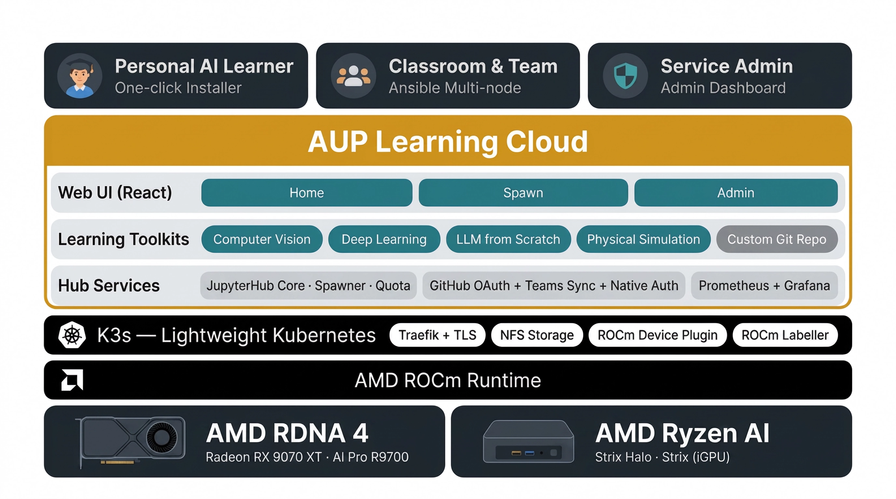

.. AUP Learning Cloud documentation master file

Welcome to AUP Learning Cloud Documentation
===========================================

AUP Learning Cloud is a tailored JupyterHub deployment designed to provide an intuitive and hands-on AI learning experience. It features a comprehensive suite of AI toolkits running on AMD hardware acceleration, enabling users to learn and experiment with ease.

.. toctree::
   :maxdepth: 2
   :caption: Introduction

   introduction/overview

.. toctree::
   :maxdepth: 2
   :caption: Installation

   installation/quick-start
   installation/single-node
   installation/customizing-deployment
   installation/multi-node
   installation/multi-node/multi-aipc-hardware-deployment

.. toctree::
   :maxdepth: 2
   :caption: Learning Toolkits

   learning-toolkits/index

.. toctree::
   :maxdepth: 2
   :caption: JupyterHub Configuration

   jupyterhub/index

.. toctree::
   :maxdepth: 2
   :caption: User Guide

   user-guide/index

.. toctree::
   :maxdepth: 1
   :caption: Contributing

   contributing/contributing

Indices and tables
==================

* :ref:`genindex`
* :ref:`search`
