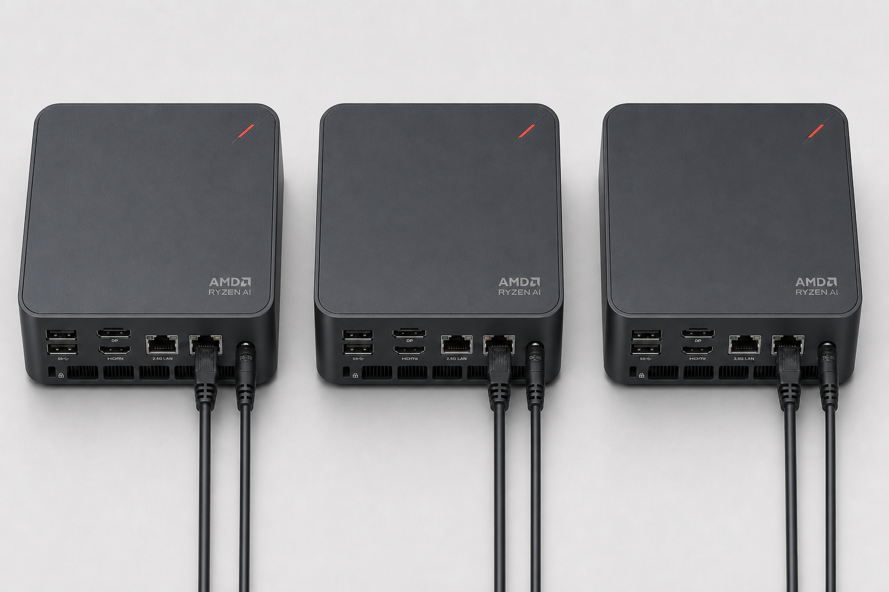
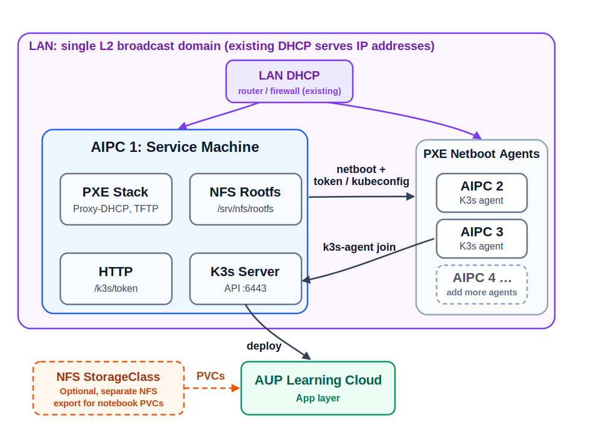
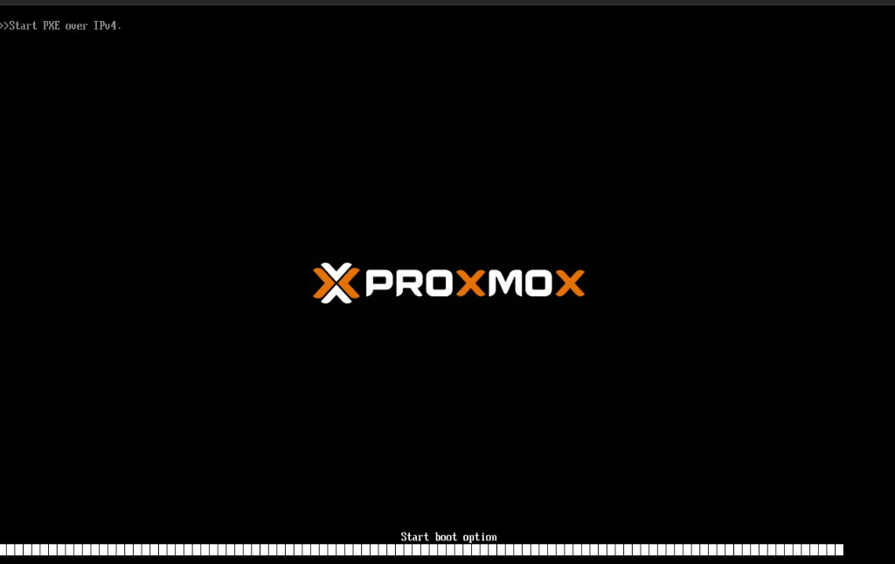
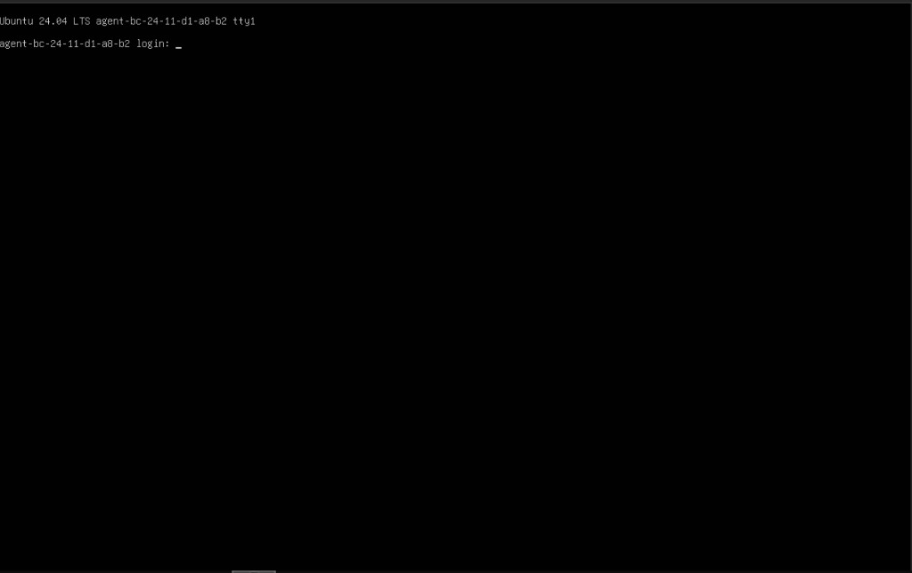
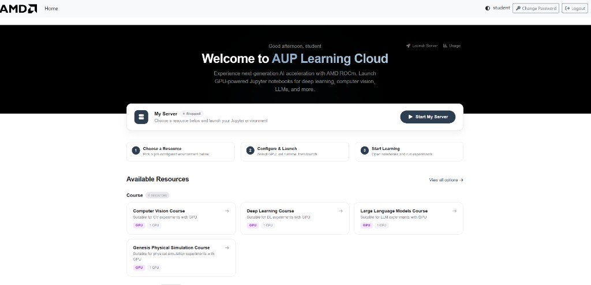

# 3 Node Mini-Cluster Example

This is a concrete, end-to-end example of building a small multi-node K3s cluster by PXE-netbooting diskless machines, then deploying AUP Learning Cloud on top of it. One service machine boots the other machines over the network, and those machines auto-join the K3s cluster with no per-machine OS install. It walks one reference topology from bare machines all the way to a JupyterHub login that can spawn a GPU notebook on a netbooted node.

The `pxe_controller` role turns the service machine into the PXE controller. It installs and configures `dnsmasq` as Proxy-DHCP + TFTP, builds an NFS root filesystem under `/srv/nfs/rootfs` with `debootstrap`, copies the netboot kernel/initrd and BIOS/UEFI boot menus to `/srv/tftp`, and prepares Apache to serve the K3s join credentials under `/k3s/`.



## Architecture



In this example **only the service machine (AIPC 1) runs an operating system you install and manage with Ansible.** AIPC 1 hosts the PXE controller and the single-node K3s server, and every Ansible playbook in this guide runs against AIPC 1.

The other machines (the agents) are **diskless**: they have no installed OS and are not managed by Ansible. They netboot from AIPC 1 and join the cluster automatically through the `k3s-auto-join.service` baked into the netboot rootfs.

::::::{note}
The standard k3s-ansible flow in this repo (`pb-k3s-site.yml` with `server` and `agent` inventory groups over SSH) is designed for the case where **every** node already has an OS installed. This PXE example is different: the agents have no OS, so you do **not** put them in the `agent` inventory group. You only configure AIPC 1 as the `server`, and the agents come up by netboot.
::::::

The netbooted agents follow this boot path:

1. Firmware asks the LAN DHCP service for an IP address.
2. `dnsmasq` on AIPC 1 replies with PXE boot metadata (Proxy-DHCP).
3. The agent downloads `pxelinux.0` for BIOS boot or `grubnetx64.efi` for UEFI.
4. The boot menu loads `vmlinuz` and `initrd.img` from TFTP.
5. The kernel mounts the read-only NFS rootfs from `/srv/nfs/rootfs`.
6. `overlayroot` provides a writable tmpfs layer.
7. `set-hostname.service` sets the hostname to `agent-<MAC>`.
8. `k3s-auto-join.service` fetches the K3s token from `http://<SERVICE_IP>/k3s/token` and joins the server at `https://<SERVICE_IP>:6443`.

## What To Prepare

A minimal example uses **three machines** on the **same LAN**:

| Role | Count | Notes |
|------|-------|-------|
| Service machine (AIPC 1) | 1 | Runs the PXE controller and the single-node K3s server. Needs a local disk and a reserved/static IP. The only Ansible-managed node. |
| Agent (AIPC 2, AIPC 3) | 2+ | Diskless workers that netboot. No OS install, not managed by Ansible. |

You also need, already in place on the LAN:

- **A DHCP server** (router/firewall/switch). `dnsmasq` here runs in **Proxy-DHCP** mode and does **not** hand out IP leases — it only adds the PXE boot information on top of your existing DHCP.
- **Internet access** from the service machine, to pull packages and build the rootfs.

Per-machine requirements:

- **Service machine**: Ubuntu 24.04, a reserved/static IP, a local disk, and network reachable by the agents.
- **Agents**: a working **in-kernel** network driver (this role ships no vendor drivers — add the module to `pxe_initramfs_modules` if needed), and a local disk if you want persistent K3s state across reboots.
- **All machines**: UEFI Secure Boot **disabled** in firmware (the UEFI path boots GRUB directly without a Microsoft-signed shim), and the ability to network-boot (PXE) from firmware.

::::::{warning}
No site values (IPs, subnet, SSH keys, passwords, tokens) ship in this repo. You set them in the inventory and the playbook, and the role **fails fast** if a required value is empty. Keep real secrets out of version control.
::::::

## Step 1 — Prepare The Service Machine

Install Ubuntu 24.04 on AIPC 1 and give it a stable IP. The same IP is used for the PXE controller, NFS rootfs, Apache token endpoint, and K3s API endpoint.

Install the operator tools and the PXE host packages (the role does not install its own host packages):

```bash
sudo apt update
sudo apt install -y git ansible curl ca-certificates jq \
  dnsmasq pxelinux syslinux-common apache2 \
  nfs-kernel-server debootstrap \
  grub-efi-amd64-signed shim-signed
```

Find the interface, subnet, and DNS you will use, and record them for Step 3:

```bash
ip -br addr
ip route
```

Clone the repository on AIPC 1 and work from its root:

```bash
git clone <REPO_URL> ~/aup-learning-cloud
cd ~/aup-learning-cloud
```

## Step 2 — Configure The Inventory

Edit `deploy/ansible/inventory.yml`. You define two things: the `pxe_controller` group (used by the PXE playbook) and the K3s `server` group (used to install the single-node master). AIPC 1 is the only host in both, and the `agent` group stays **empty** because the netboot agents are not Ansible-managed.

```yaml
k3s_cluster:
  children:
    server:
      hosts:
        aipc1:
          ansible_host: <SERVICE_IP>
    agent:
      hosts: {}        # diskless netboot agents auto-join; do NOT list them here
  vars:
    ansible_user: root
    k3s_version: v1.32.3+k3s1
    token: "<paste-a-strong-random-token>"   # openssl rand -base64 64
    api_endpoint: "{{ hostvars[groups['server'][0]]['ansible_host'] | default(groups['server'][0]) }}"

pxe_controller:
  hosts:
    aipc1:
      ansible_host: <SERVICE_IP>
  vars:
    ansible_port: 22
    ansible_user: root
```

::::::{note}
Keep `k3s_version` here in sync with `pxe_k3s_version` in the PXE playbook (Step 3). K3s requires every agent to be the same version as, or older than, the server.
::::::

## Step 3 — Configure The PXE Controller Playbook

Edit the `vars:` block in `deploy/ansible/playbooks/pb-pxe-controller.yml`. The required values are empty by default — set them all:

```yaml
pxe_rootfs_force_rebuild: true        # true for the first build

pxe_network_interface: "enp1s0"       # service-machine NIC (from Step 1)
pxe_subnet: "192.168.1.0/24"          # node subnet, CIDR
pxe_dns_servers: "8.8.8.8,8.8.4.4"    # DNS for the rootfs

pxe_controller_ip: "192.168.1.10"     # this service machine's IP
pxe_k3s_server_ips:
  - "192.168.1.10"                    # K3s server IP (this machine)

pxe_k3s_version: "v1.32.3+k3s1"       # must match inventory k3s_version

pxe_rootfs_authorized_keys:
  - "ssh-ed25519 AAAA... you@host"    # at least one key is required
```

::::::{note}
`pxe_gateway` is optional and currently informational only. `pxe_rootfs_password` can stay empty to keep root password login disabled (key-only). Use `pxe_rootfs_force_rebuild: true` for the first build, then set it back to `false` once the rootfs is stable so you do not rebuild it underneath running agents.
::::::

## Step 4 — Run The PXE Controller Playbook

```bash
cd ~/aup-learning-cloud/deploy/ansible
ansible-playbook -i inventory.yml playbooks/pb-pxe-controller.yml
```

The role builds the NFS rootfs, installs the agent boot services into it, pins and installs the K3s agent binary, copies the kernel/initrd and boot menus to `/srv/tftp`, configures NFS and `dnsmasq`, and prepares the Apache `/k3s/` directory. When it finishes it prints a summary with the controller IP and a short next-steps list.

## Step 5 — Verify The Controller

```bash
systemctl is-active dnsmasq nfs-kernel-server apache2
showmount -e localhost
ls -l /srv/tftp/pxelinux.0 /srv/tftp/grubnetx64.efi /srv/tftp/vmlinuz /srv/tftp/initrd.img
curl -I http://127.0.0.1/k3s/
```

Expected: `dnsmasq`, `nfs-kernel-server`, and `apache2` are all `active`; `showmount` lists `/srv/nfs/rootfs` exported to your subnet; the four boot files exist under `/srv/tftp`; and `http://127.0.0.1/k3s/` returns `403` (the directory exists but is empty and not listable). The `token` endpoint is `404` until you publish it in Step 7.

## Step 6 — Install The Single-Node K3s Server

Install the K3s server on AIPC 1 using the repo's existing k3s-ansible flow. With the `server` group pointing at AIPC 1 and the `agent` group empty (from Step 2), this installs a single-node master and configures `kubectl` for your user automatically.

```bash
cd ~/aup-learning-cloud/deploy/ansible
sudo ansible-playbook -i inventory.yml playbooks/pb-base.yml
sudo ansible-playbook -i inventory.yml playbooks/pb-k3s-site.yml
```

Verify the server is up and `kubectl` works:

```bash
sudo k3s kubectl get nodes -o wide
kubectl get nodes -o wide
```

::::::{note}
The netbooted agents are diskless and are intentionally **not** in the `agent` inventory group, so `pb-k3s-site.yml` only installs the server. The agents join later by netboot (Step 8), not through this playbook.
::::::

## Step 7 — Publish K3s Credentials For The Agents

At boot, each agent's `k3s-auto-join.sh` fetches `http://<SERVICE_IP>/k3s/token` and `http://<SERVICE_IP>/k3s/kubeconfig`. Publish both through Apache:

```bash
sudo install -d -m 0755 /var/www/html/k3s

sudo install -m 0644 \
  /var/lib/rancher/k3s/server/token \
  /var/www/html/k3s/token

sudo sed "s#https://127.0.0.1:6443#https://<SERVICE_IP>:6443#g" \
  /etc/rancher/k3s/k3s.yaml | sudo tee /var/www/html/k3s/kubeconfig >/dev/null

sudo chmod 0644 /var/www/html/k3s/token /var/www/html/k3s/kubeconfig
sudo systemctl reload apache2
```

Verify the endpoints respond:

```bash
curl -fsS http://127.0.0.1/k3s/token >/dev/null && echo token-ok
curl -fsS http://127.0.0.1/k3s/kubeconfig >/dev/null && echo kubeconfig-ok
curl -kfsS https://<SERVICE_IP>:6443/ping
```

The Apache ACL generated by the role allows your `pxe_subnet` and localhost. If an agent cannot fetch the token, recheck `pxe_subnet` and the generated Apache config.

## Step 8 — Netboot The Agents

On each agent machine: connect it to the same LAN as AIPC 1, enter firmware setup, disable Secure Boot, enable network boot, and put PXE before local disk in the boot order. BIOS and UEFI PXE both work — the role generates menus for both. Save and boot.

In firmware this is usually a `Boot Device Priority` (or `Boot Order`) screen listing each bootable device. You will see the local disk entry (for example `SATA`, `SCSI`, or `NVMe`) alongside one or more network-boot entries, named something like `PXE`, `Network`, `IBA GE Slot ...`, or `... etherboot`. Move a network/PXE entry to the top so the machine attempts netboot before the local disk, then save and exit. The exact labels vary by vendor, but the goal is the same: the first boot device is the NIC, not the disk.

As the machine netboots you should first see a firmware line such as `>>Start PXE over IPv4`, then the PXE boot menu, where the default entry is `AUP Learning Cloud K3s Agent (Network Boot)`. Let it boot (or select that entry). When it finishes you land at a console login prompt for the generated hostname, for example `agent-bc-24-11-d1-a8-b2 login:` — that confirms the NFS rootfs booted.

::::::{note}
The screenshots below use a virtual machine as the example agent (here a Proxmox VM), so your firmware and console will look different on physical hardware, but the sequence is the same.
::::::





After boot, each agent mounts `/srv/nfs/rootfs`, sets its hostname to `agent-<MAC>`, mounts its local K3s persistence disk, fetches the token, and joins the server.

Watch node registration from AIPC 1:

```bash
watch kubectl get nodes -o wide
```

Expected: AIPC 1 is `Ready`, and each netbooted agent shows up as an `agent-<MAC>` node and becomes `Ready`.

## Step 9 — Validate Agent Persistence

Reboot one agent and confirm it rejoins with the same node identity rather than as a new node:

```bash
kubectl get nodes -o wide
```

On the agent, confirm the persistent K3s data mount and node password exist:

```bash
mount | grep /var/lib/rancher/k3s
test -f /var/lib/rancher/k3s/node-password && echo node-password-ok
systemctl status mount-local-disk --no-pager
systemctl status k3s-agent --no-pager
```

If an agent reboots but cannot rejoin, inspect the boot services on the agent:

```bash
journalctl -u mount-local-disk -n 100 --no-pager
journalctl -u k3s-auto-join -n 100 --no-pager
journalctl -u k3s-agent -n 100 --no-pager
```

If a stale node object blocks rejoin during testing, delete it from AIPC 1 and reboot the agent. This is a debugging action, not a normal operating procedure:

```bash
kubectl delete node <AGENT_NODE_NAME>
```

## Step 10 — Install The AMD GPU Device Plugin And Labeller

Deploy the AMD GPU device plugin and the ROCm node labeller so GPUs are schedulable and labelled:

```bash
kubectl create -f https://raw.githubusercontent.com/ROCm/k8s-device-plugin/master/k8s-ds-amdgpu-dp.yaml
kubectl create -f https://raw.githubusercontent.com/ROCm/k8s-device-plugin/master/k8s-ds-amdgpu-labeller.yaml
```

Verify GPU resources and labels on the agents:

```bash
kubectl get pods -A | grep -i amd
kubectl describe node <AGENT_NODE_NAME> | grep amd.com/gpu
```

Use the labels that actually appear on your agents when you write the chart values in Step 12. Common keys include `amd.com/gpu.product-name`, `amd.com/gpu.family`, and `amd.com/gpu.device-id`.

Example:

```bash
kubectl describe node agent-10-b6-76-52-64-02 | grep amd.com/gpu
Labels:             amd.com/gpu.cu-count=40
                    amd.com/gpu.device-id=1586
                    amd.com/gpu.family=GC_11_5_0
                    amd.com/gpu.product-name=AMD_Radeon_8060S_Graphics
                    amd.com/gpu.simd-count=80
                    amd.com/gpu.vram=64G
                    beta.amd.com/gpu.cu-count=40
                    beta.amd.com/gpu.cu-count.40=1
                    beta.amd.com/gpu.device-id=1586
                    beta.amd.com/gpu.device-id.1586=1
                    beta.amd.com/gpu.family=GC_11_5_0
                    beta.amd.com/gpu.family.GC_11_5_0=1
                    beta.amd.com/gpu.product-name=AMD_Radeon_8060S_Graphics
                    beta.amd.com/gpu.product-name.AMD_Radeon_8060S_Graphics=1
                    beta.amd.com/gpu.simd-count=80
                    beta.amd.com/gpu.simd-count.80=1
                    beta.amd.com/gpu.vram=64G
                    beta.amd.com/gpu.vram.64G=1
  amd.com/gpu:        1
  amd.com/gpu:        1
  amd.com/gpu        0               0
```

## Step 11 — Prepare Shared NFS Storage For Notebook PVCs

The PXE NFS rootfs is not the notebook storage backend. Create a separate NFS export for Kubernetes PVCs; it can run on AIPC 1 for a small lab.

```bash
sudo mkdir -p <NFS_EXPORT>
sudo chown -R nobody:nogroup <NFS_EXPORT>
sudo chmod 0777 <NFS_EXPORT>
echo "<NFS_EXPORT> <CLUSTER_SUBNET>(rw,sync,no_subtree_check,no_root_squash,insecure)" | sudo tee /etc/exports.d/auplc.conf
sudo exportfs -ra
sudo systemctl restart nfs-kernel-server
showmount -e localhost
```

Create local Helm values for the NFS provisioner from the shipped example and install it:

```bash
cd ~/aup-learning-cloud
cp deploy/k8s/nfs-provisioner/values.yaml deploy/k8s/nfs-provisioner/values.local.yaml
# edit values.local.yaml: set nfs.server, nfs.path, and storageClass.name (nfs-client)

helm repo add nfs-subdir-external-provisioner https://kubernetes-sigs.github.io/nfs-subdir-external-provisioner/
helm repo update
helm upgrade --install nfs-subdir-external-provisioner \
  nfs-subdir-external-provisioner/nfs-subdir-external-provisioner \
  --namespace nfs-provisioner --create-namespace \
  -f deploy/k8s/nfs-provisioner/values.local.yaml
```

Verify the storage class and provisioner pod:

```bash
kubectl get storageclass
kubectl get pods -n nfs-provisioner
```

## Step 12 — Configure JupyterHub Values

Create a deployment-specific values file from the multi-node example:

```bash
cd ~/aup-learning-cloud/runtime
cp values-multi-nodes.yaml.example values-basic-example.yaml
# edit values-basic-example.yaml
```

At minimum set the auth mode, the GPU node selector to match your real labels, the notebook images, and the storage class. A NodePort proxy keeps the example simple:

```yaml
custom:
  authMode: "dummy"
  accelerators:
    strix-halo:
      nodeSelector:
        amd.com/gpu.product-name: "<GPU_PRODUCT_LABEL>"
      quotaRate: 3
  resources:
    images:
      cpu: "<CPU_NOTEBOOK_IMAGE>"
      gpu: "<GPU_NOTEBOOK_IMAGE>"

hub:
  db:
    pvc:
      storageClassName: nfs-client

singleuser:
  storage:
    dynamic:
      storageClass: nfs-client

proxy:
  service:
    type: NodePort
    nodePorts:
      http: 30890
```

::::::{warning}
Do not reuse a site-specific values override as-is. It may contain real hostnames, OAuth settings, image tags, or registry credentials that must be replaced. For a private registry, create the image pull secret in the `jupyterhub` namespace before installing the chart.
::::::

## Step 13 — Deploy AUP Learning Cloud

```bash
cd ~/aup-learning-cloud
helm upgrade --install jupyterhub ./runtime/chart \
  --namespace jupyterhub --create-namespace \
  -f runtime/values.yaml \
  -f runtime/values-basic-example.yaml
```

Wait for the pods, then open the Hub. For the NodePort example, browse to `http://<SERVICE_IP>:30890`:

```bash
kubectl get pods -n jupyterhub -o wide
kubectl get svc -n jupyterhub
```

## Step 14 — End-To-End Validation

Validate the infrastructure first:

```bash
kubectl get nodes -o wide
kubectl get pods -A
kubectl get storageclass
kubectl describe node <AGENT_NODE_NAME> | grep amd.com/gpu
```

Expected: AIPC 1 and both netbooted agents are `Ready`; no platform pod is stuck in `CrashLoopBackOff`, `Pending`, or `ImagePullBackOff`; `nfs-client` exists; and AMD GPU resources/labels appear on the agent nodes.

Then validate the user path. Open AUP Learning Cloud in a browser — for the NodePort example from Step 13 that is `http://<SERVICE_IP>:30890` (use your ingress host instead if you configured one):

```text
http://<SERVICE_IP>:30890
```



Log in, spawn a CPU notebook, create a file in the notebook home, restart the notebook and confirm the file persists, then spawn a GPU notebook and confirm its pod lands on a netbooted agent:

```bash
kubectl get pods -n jupyterhub -o wide
kubectl describe pod <USER_POD_NAME> -n jupyterhub
```

## Troubleshooting

| Symptom | Likely cause | First checks |
|---------|--------------|--------------|
| Playbook fails immediately on an assert | A required var is still empty | Re-check `pxe_controller_ip`, `pxe_subnet`, `pxe_network_interface`, `pxe_dns_servers`, `pxe_k3s_server_ips`, and at least one SSH key |
| Agent never shows the PXE menu | Firmware boot order, network boot disabled, or Proxy-DHCP not reaching the client | Check firmware, switch port, `systemctl status dnsmasq`, and `journalctl -u dnsmasq` |
| Agent gets an IP but cannot load boot files | TFTP blocked, missing files, or UEFI Secure Boot still enabled | Check `/srv/tftp`, firewall rules, that Secure Boot is disabled, and `dnsmasq` logs |
| Agent has no network during netboot | Agent NIC has no in-kernel driver in the initramfs | Identify the NIC with `lspci -nnk`, add its in-kernel module to `pxe_initramfs_modules`, and rebuild the rootfs |
| Agent kernel boots but cannot mount rootfs | NFS export, subnet ACL, or wrong `pxe_controller_ip` | Check `showmount -e <SERVICE_IP>`, `/etc/exports`, and the rootfs kernel args |
| Agent waits for the K3s token | Token not published or Apache ACL blocks the client subnet | Check `curl http://<SERVICE_IP>/k3s/token` and the Apache config |
| Agent joins once but fails after reboot | Missing local K3s persistence or lost node password | Check `mount-local-disk`, `/var/lib/rancher/k3s/node-password`, and `k3s-agent` logs |
| Agent fails to join with a version error | Agent rootfs k3s version newer than the server | Align `pxe_k3s_version` with the server `k3s_version` and rebuild the rootfs |
| GPU notebook stays Pending | Chart `nodeSelector` does not match real labels, or GPUs are exhausted | Check `kubectl describe pod <pod> -n jupyterhub` and the node labels |
| PVC stays Pending | StorageClass name mismatch or NFS provisioner cannot mount the export | Check `kubectl get storageclass`, provisioner logs, and the NFS export |

## Out Of Scope

The following are useful for a longer-running site but are not required for this minimal example: a Zot registry mirror, Cloudflare Tunnel ingress, monitoring and Grafana, HA K3s, external databases, and NPU-specific setup. Add them only after the minimal deployment can boot the agents, schedule GPU notebooks, and persist notebook storage.

## Scope and Limitations

This is a minimal teaching/lab example, not a production reference. To keep it to three machines, the service machine (AIPC 1) runs **everything central on one host**: the PXE controller, the TFTP/NFS rootfs, the Apache K3s credential endpoint, the **single-node K3s server (control plane)**, and the notebook **NFS storage**. Keep these consequences in mind:

- **Single point of failure.** If AIPC 1 goes down, the control plane, the netboot path, and notebook storage all go down with it. The agents also lose their NFS rootfs, so they cannot run while AIPC 1 is offline.
- **No high availability.** There is one K3s server with embedded SQLite, no HA control plane, and no external database.
- **Shared resource contention.** PXE/NFS/Apache/K3s-server and the notebook storage compete for the same CPU, memory, disk, and network on one box.
- **Storage durability.** The example NFS export lives on AIPC 1's local disk with no replication or backup; treat notebook data as disposable unless you add your own backups.
- **Agents are volatile.** Netboot agents run from a read-only NFS rootfs with a tmpfs overlay; only the local K3s data dir persists across reboots.

For a longer-running or production deployment, split these roles onto separate hosts, use an HA K3s control plane with an external/replicated datastore, and back the storage with a dedicated, redundant NFS (or other) backend.
