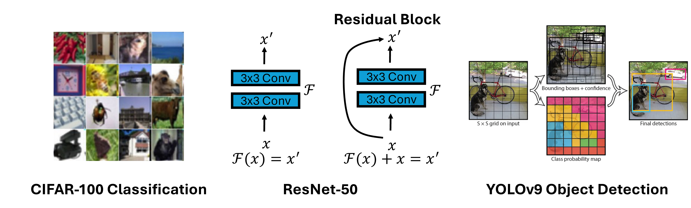
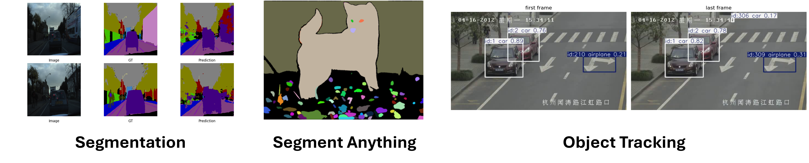
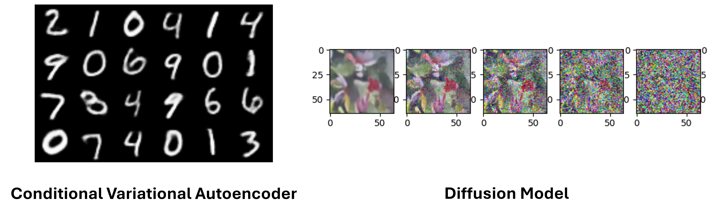

# Computer Vision

From classifying a single image to tracking objects across video frames and generating entirely new images from noise, this toolkit covers the full spectrum of modern computer vision. Across 8 progressive labs you will build, train, and deploy models in PyTorch on AMD GPUs, gaining hands-on experience with the architectures that power real-world vision systems.

:::{admonition} Goals
:class: tip
- Build and train CNN and ResNet classifiers for image recognition
- Apply object detection (YOLOv9) and semantic segmentation (SegNet) to real-world datasets
- Use foundation models like Segment Anything (SAM) for zero-shot segmentation
- Implement multi-object tracking across video frames
- Explore generative models including VAE, Conditional VAE, and Diffusion Models
:::

## Classification and Detection (CV01 to CV03)

::::{note} What this section covers
Supervised image classification with CNNs and ResNets, followed by object detection with YOLO. These labs establish the core skills for understanding and localising objects in images.
::::

### CV01 - Image Classification with CNN

Build a Convolutional Neural Network from scratch and train it on the CIFAR-100 dataset (100 object categories). You will implement convolutional blocks, batch normalisation, dropout, and a fully connected classifier head using PyTorch, then monitor training progress through loss and accuracy curves.

### CV02 - Deep Residual Networks (ResNet-50)

Train a ResNet-50 classifier on CIFAR-100 and explore how residual (skip) connections solve the vanishing-gradient problem in very deep networks. The lab covers Top-1 and Top-5 accuracy evaluation and qualitative inspection of sample predictions.

### CV03 - Object Detection with YOLOv9

Apply YOLOv9, a state-of-the-art one-stage detector, to locate and classify multiple objects in a single forward pass. You will train the model for around 10 epochs, evaluate it on validation images, and visualise detection bounding boxes.

## Segmentation and Tracking (CV04 to CV06)

::::{note} What this section covers
Pixel-level understanding and temporal reasoning. These labs move beyond bounding boxes to dense prediction and multi-frame object tracking.
::::

### CV04 - Semantic Segmentation with SegNet

Train a SegNet encoder-decoder on the CamVid autonomous-driving dataset to assign a class label (road, car, pedestrian, building, etc.) to every pixel in an image. The lab saves checkpoints and produces side-by-side comparisons of predictions vs. ground truth.

### CV05 - Segment Anything (SAM)

Run inference with Meta AI's Segment Anything Model (SAM), a foundation model that generalises to any image without task-specific training. The lab covers both *automatic* (all-mask) and *prompt-based* (point/box) segmentation modes, producing coloured overlay maps.

### CV06 - Multi-Object Tracking with YOLOv8 + ByteTrack

Apply a pretrained YOLOv8 detector combined with the ByteTrack association algorithm to track multiple objects across video frames, assigning each a persistent identity. No training is required; the lab focuses on end-to-end inference on custom videos.

## Generative Models (CV07 to CV08)

::::{note} What this section covers
Learning to generate new images rather than just recognise them. These labs explore two powerful generative paradigms: variational autoencoders and diffusion models.
::::

### CV07 - Variational Autoencoder (VAE and cVAE)

Implement a Variational Autoencoder on MNIST to learn a probabilistic latent space, then sample from it to generate new handwritten digits. The lab also covers the Conditional VAE (cVAE) variant, which lets you control which digit class is generated.

### CV08 - Diffusion Model

Build and train a Diffusion Model that learns to generate images by iteratively denoising random noise. The lab walks through the forward diffusion process (gradually adding noise) and the reverse denoising process (learning to recover clean images), giving you a practical understanding of the generative framework behind models like Stable Diffusion and DALL-E.

::::{seealso}
Explore the other learning toolkits: [Deep Learning](deep-learning.md), [LLM from Scratch](llm-from-scratch.md), [Physics Simulation](physics-simulation.md).
::::
