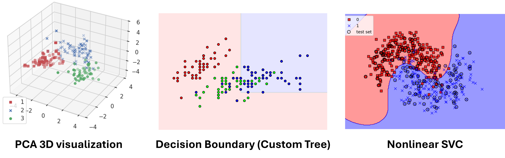
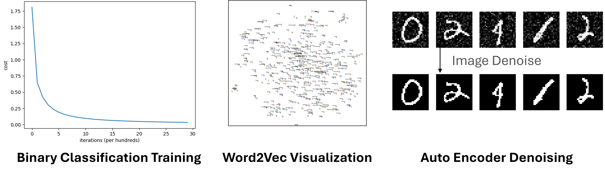
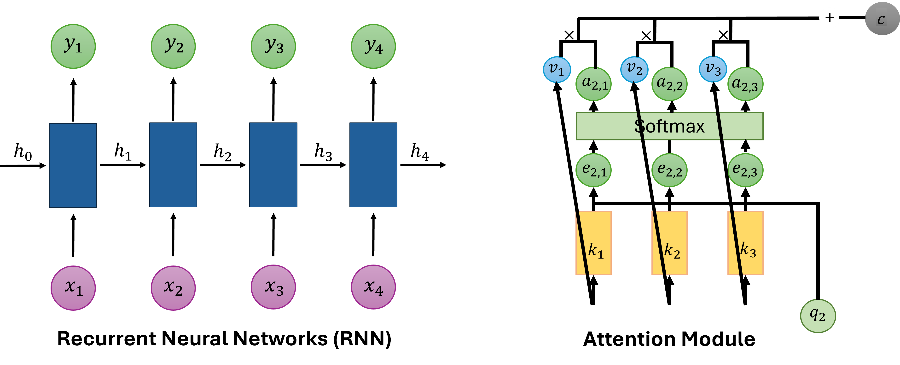

# Deep Learning

Whether you are picking up machine learning for the first time or looking to solidify your foundations before diving into large-scale models, this toolkit has you covered. Across 12 progressive labs you will move from classical algorithms all the way to modern generative architectures, writing real code, training real models, and visualising real results on AMD GPUs.

:::{admonition} Goals
:class: tip
- Build classical ML algorithms (PCA, SVM, K-Means, Decision Trees, Regression) from first principles
- Implement a fully-connected neural network from scratch using only NumPy
- Train CNNs, autoencoders, and GANs in PyTorch for image tasks
- Work with sequence models (LSTM Seq2Seq) and word embeddings (Word2Vec)
- Construct a Transformer from scratch for text generation
:::

## Foundational Machine Learning (DL01 to DL05)

::::{note} What this section covers
Dimensionality reduction, classification, clustering, and regression. Each lab uses clean, from-scratch implementations so you truly understand what happens under the hood.
::::

### DL01 - Principal Component Analysis (PCA)

Implement PCA from scratch using eigendecomposition on the Wine dataset. You will see how high-dimensional data can be projected onto just a few principal components while preserving the most meaningful variance, a technique that underpins countless ML pipelines.

### DL02 - Support Vector Machine (SVM)

Apply an SVM classifier with kernel functions to a non-linearly separable moon-shaped dataset. Tune the regularisation parameter and kernel type to push test accuracy above 95 %, and visualise the resulting decision boundary to build geometric intuition for margin-based classifiers.

### DL03 - K-Means Clustering

Implement the K-Means algorithm step by step (initialisation, assignment, and centroid update) and animate how clusters evolve over iterations. Exploring different values of *k* reveals the trade-off between cluster granularity and generalisation.

### DL04 - Decision Tree

Train and visualise a Decision Tree classifier on the Iris dataset. Experimenting with `max_depth` and splitting criteria lets you observe underfitting vs. overfitting first-hand, while the tree structure itself provides a window into interpretable ML.

### DL05 - Regression Model

Build a linear regression model to predict California housing prices. From feature preprocessing to evaluation with MSE, MAE, and R², this lab covers the full supervised-learning workflow for continuous targets.

## Core Deep Learning (DL06 to DL09)

::::{note} What this section covers
Neural networks from scratch, word embeddings, convolutional networks, and autoencoders. These labs bridge the gap between classical ML and modern deep learning.
::::

### DL06 - Neural Network from Scratch

Implement a fully-connected neural network using only NumPy, covering He initialisation, sigmoid/softmax activations, BCE/CCE loss, and backpropagation, without any deep learning framework. Apply it to binary classification (Iris) and multi-class classification (EMG hand-gesture dataset) to cement your understanding of how gradients flow.

### DL07 - Word2Vec

Train a Word2Vec model on the Text8 corpus with both Skip-gram and CBOW architectures plus negative sampling. Explore semantic relationships through vector arithmetic (e.g., *king − man + woman ≈ queen*) and visualise the learned embedding space with PCA / t-SNE.

### DL08 - Basic CNN on CIFAR-10

Build and train a Convolutional Neural Network on CIFAR-10 (10 object categories) in PyTorch. The lab walks through every stage, from data loading and model construction to training loop, evaluation, and qualitative prediction visualisation, giving you a reusable template for image classification tasks.

### DL09 - Denoising AutoEncoder

Implement both an MLP-based and a CNN-based AutoEncoder to strip artificial noise from MNIST digit images. Comparing the two architectures side by side highlights how convolutional layers capture spatial structure far more effectively than plain linear layers.

## Advanced Architectures (DL10 to DL12)

::::{note} What this section covers
Sequence-to-sequence translation, generative adversarial networks, and the Transformer. These are the architectures behind today's most powerful AI systems.
::::

### DL10 - Sequence-to-Sequence (Seq2Seq) Translation

Build an LSTM-based Seq2Seq model for English-to-Chinese translation using a small sentence-pair dataset. The lab covers teacher forcing during training and step-by-step inference, showing how an encoder-decoder framework handles variable-length input and output sequences.

### DL11 - Generative Adversarial Network (DCGAN)

Train a Deep Convolutional GAN on MNIST where a generator learns to synthesise realistic digit images from random noise while a discriminator learns to tell real from fake. Watching generated samples improve epoch by epoch makes the adversarial training dynamic tangible.

### DL12 - Transformer from Scratch

Implement a minimal Transformer for character-level language generation, including multi-head self-attention, layer normalisation, positional embeddings, and feed-forward blocks, entirely from scratch in PyTorch. This lab ties together everything you have learned and opens the door to understanding modern LLMs.

::::{seealso}
Explore the other learning toolkits: [Computer Vision](computer-vision.md), [LLM from Scratch](llm-from-scratch.md), [Physics Simulation](physics-simulation.md).
::::
