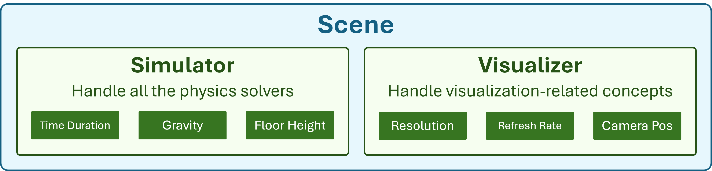
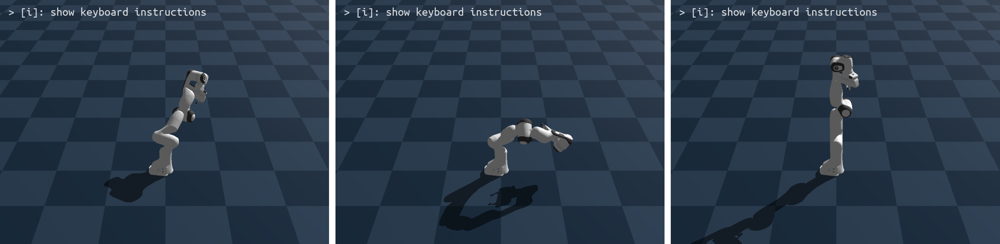
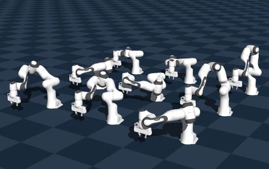

# Physics Simulation

This toolkit introduces Genesis, a high-performance physics engine with native AMD GPU (ROCm/HIP) support. Through four progressive labs you will go from loading your first robot into a simulated scene to running hundreds of parallel environments on the GPU, laying the foundation for modern robot learning and reinforcement training.

:::{admonition} Goals
:class: tip
- Set up a Genesis simulation with a simulator, visualiser, and robot model
- Apply PD controllers to stabilise and command a robot arm
- Use Inverse Kinematics and motion planning to perform a pick-and-place task
- Scale to massively parallel simulation for data-efficient reinforcement learning
:::

## Setting Up and Controlling Robots (PhySim01 to PhySim02)

::::{note} What this section covers
Genesis scene structure, GPU backend initialisation, loading robot models, and applying PD controllers to stabilise and command a robot arm.
::::

### PhySim01 - Hello Genesis: Load a Robot into a Scene

Set up your first Genesis simulation environment: initialise the AMD GPU backend, configure the simulator (time step, gravity, floor height) and visualiser (camera position, field of view, FPS), then load a robot model into the scene and step the simulation forward.

### PhySim02 - Control Your Robot

Without active control a robot arm simply collapses under gravity. In this lab you apply PD (Proportional-Derivative) controllers to stabilise the arm and command it to reach target joint positions. Learn how Genesis exposes built-in controllers and how to tune gains for stable motion.

## Manipulation and Motion Planning (PhySim03)

::::{note} What this section covers
Inverse Kinematics for end-effector positioning and waypoint-based motion planning for a complete pick-and-place task.
::::

### PhySim03 - Grasping with IK and Motion Planning

Implement a complete pick-and-place task: use Inverse Kinematics (IK) to automatically compute joint angles for a target end-effector pose, then chain IK waypoints into a motion plan to hover above, descend to, grasp, and lift a cube.

:::{image} ../_static/images/teaching_solution_img/PhySim_05_IK_motion.png
:alt: Robot arm executing an IK-planned motion trajectory toward a target object
:width: 544px
:::

## Scaling with Parallelism (PhySim04)

::::{note} What this section covers
Massive GPU-based parallelism for reinforcement learning. Run hundreds of independent environments simultaneously within a single Genesis scene.
::::

### PhySim04 - Parallel Simulation

Scale up to massive parallelism by running hundreds of independent robot environments simultaneously on the GPU within a single Genesis scene. This is the key technique behind data-efficient reinforcement learning, generating thousands of experience trajectories in the time it would take to run one.

::::{seealso}
Explore the other learning toolkits: [Computer Vision](computer-vision.md), [Deep Learning](deep-learning.md), [LLM from Scratch](llm-from-scratch.md).
::::
