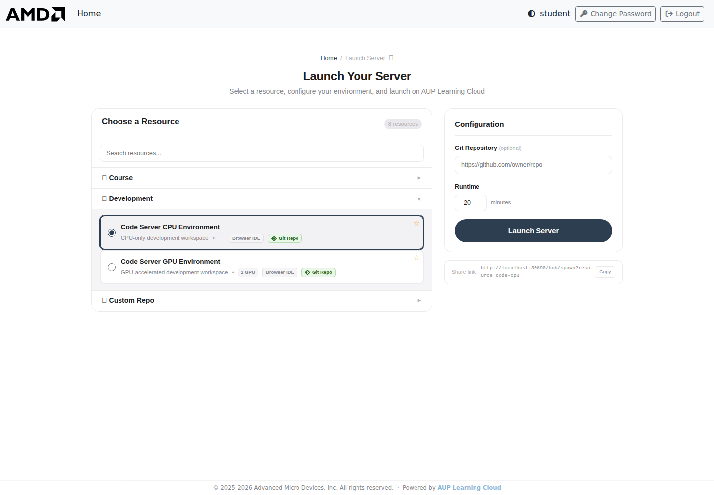
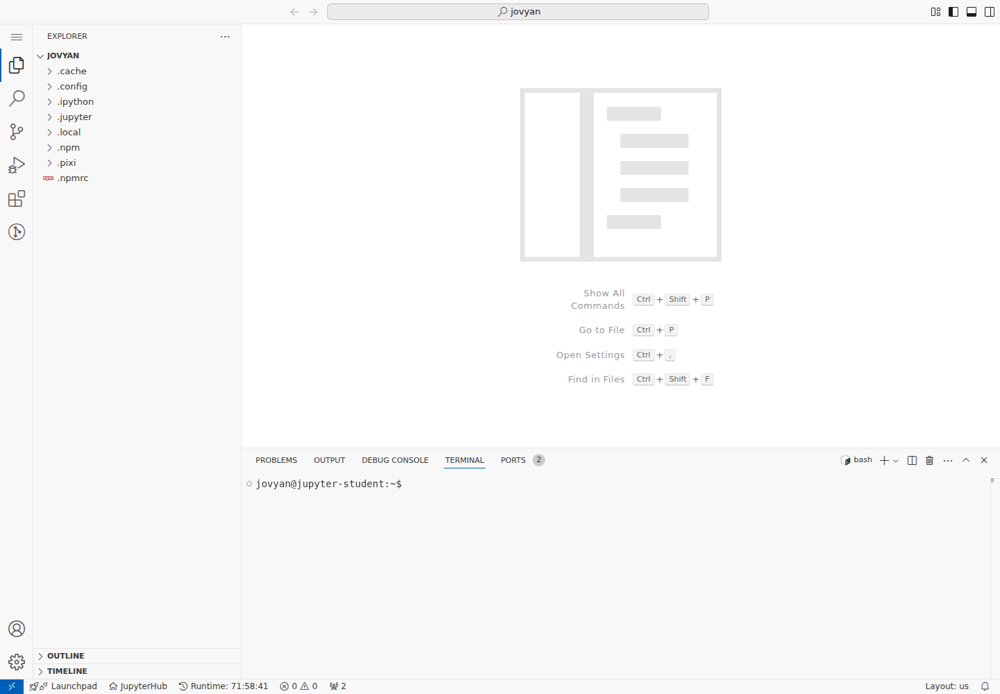
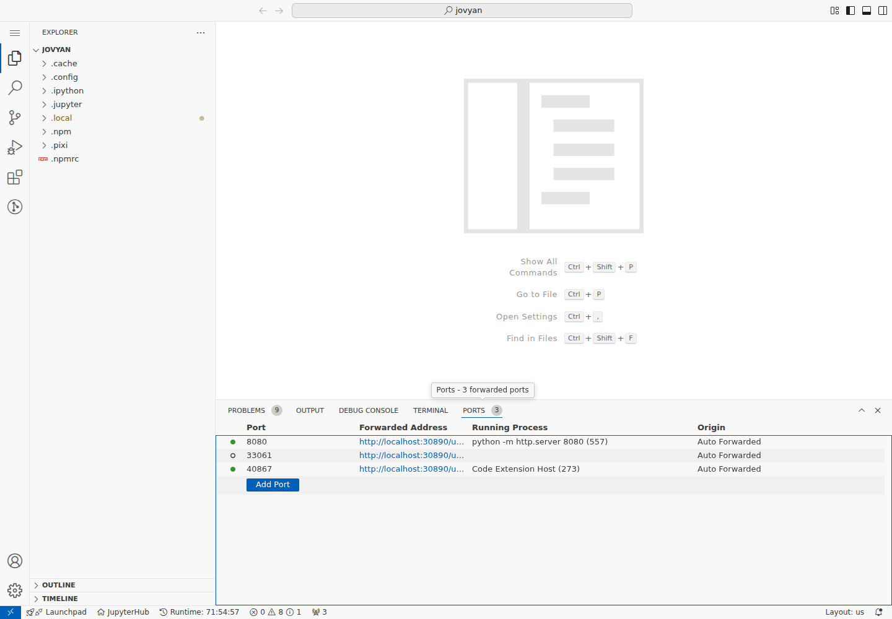
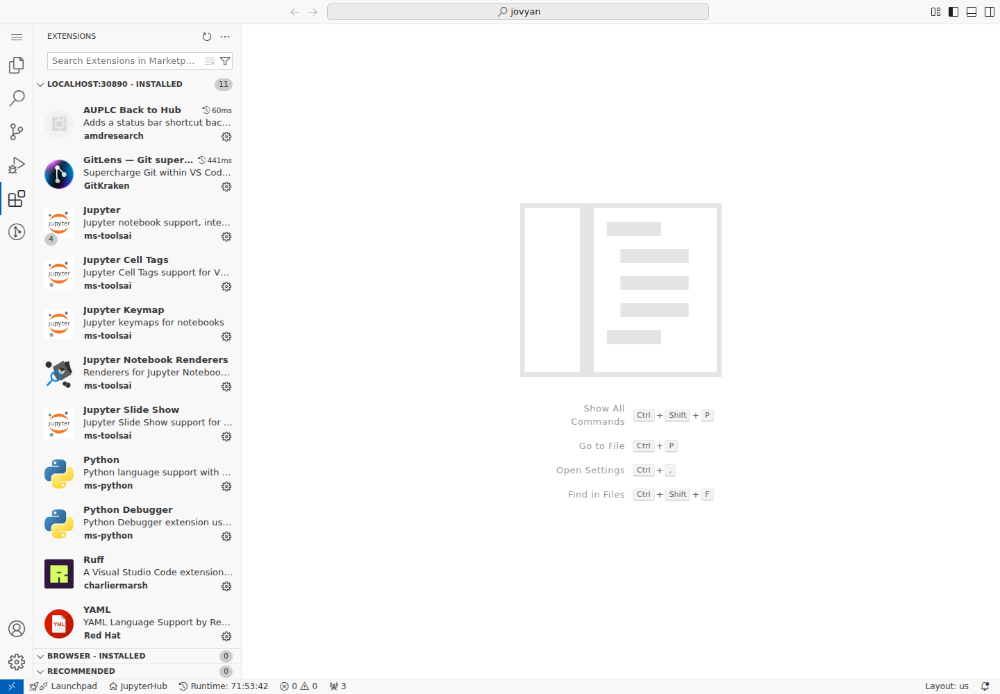

# Code Server Guide

This guide explains how to use Code Server in AUP Learning Cloud. Code Server provides a browser-based VS Code experience for coding, terminals, extensions, debugging, and web application previews.

For login, environment selection, storage, and stopping servers, start with [Platform Basics](platform-basics.md).

## When To Use Code Server

Use Code Server when you want to:

- Work in a VS Code-style editor from the browser
- Use integrated terminals
- Run scripts, training jobs, or development servers
- Install editor extensions
- Preview web applications through forwarded ports
- Work with multi-file projects or Git repositories

If your task is mainly notebook-based, use [JupyterLab Guide](jupyterlab-guide.md).

## Start A Code Server Environment

1. Sign in to AUP Learning Cloud.
2. Select **Code Server CPU Environment** or **Code Server GPU Environment**.
3. Choose the required hardware resources.
4. Choose the runtime duration.
5. Click **Launch Server**.
6. Wait for the browser to open the VS Code interface.

<!-- TODO: Add screenshot of Code Server environment selection. -->
<!--  -->

## Interface Overview

The Code Server interface is similar to local VS Code:

- Left side: Explorer, Search, Source Control, Run and Debug, Extensions
- Center: code editor
- Bottom panel: Terminal, Ports, Output, Problems

<!-- TODO: Add screenshot of the Code Server main interface. -->
<!--  -->

## Use The Terminal

Open the integrated terminal with `Ctrl + \`` or from the top menu.

Common commands:

```bash
# Check GPU status in GPU environments
rocm-smi

# Install Python packages
pip install torch torchvision

# Run a script
python train.py

# Start a simple web server
python -m http.server 8080
```

You can open multiple terminal sessions by clicking the `+` button in the terminal panel.

## Save Files

Use the same storage rules as other AUP Learning Cloud environments:

- Save important work under `/home/jovyan`.
- Do not rely on temporary or image-provided directories for long-term storage.
- Copy work to `/home/jovyan` before stopping the server.

Example:

```bash
cp <file-or-directory-to-save> /home/jovyan/
```

## Port Forwarding

When you run a web service inside Code Server, the platform can expose it through the browser.

Example:

```bash
python -m http.server 8080
```

After the service starts:

1. Look for a port forwarding notification in the lower-right corner.
2. Click **Open in Browser** if the notification appears.
3. Or open the **PORTS** panel and select the forwarded port.
4. If the port does not appear automatically, add it manually in the **PORTS** panel.

<!-- TODO: Add screenshot of the port forwarding notification. -->
<!--  -->

<!-- TODO: Add screenshot of the PORTS panel. -->
<!--  -->

Forwarded URLs usually follow this pattern:

```text
https://www.openhw.io/user/<your-username>/proxy/<port>/
```

Example:

```text
https://www.openhw.io/user/github%3Ausername/proxy/3000/
```

:::{note}
Port forwarding works for HTTP and WebSocket services that listen on a port inside your remote environment. Make sure your application is actually running and listening on the expected port.
:::

## Extensions

Code Server supports many VS Code extensions. Common preinstalled extensions may include:

| Extension | Purpose |
|---|---|
| Python | Python language support, IntelliSense, and debugging |
| Jupyter | Notebook support inside VS Code |
| GitLens | Git history, blame, and comparison tools |
| Python Debugger | Python breakpoint debugging |
| Ruff | Python formatting and linting |
| YAML | YAML syntax support |

To install an extension:

1. Open the Extensions panel on the left.
2. Search for the extension name.
3. Click **Install**.

<!-- TODO: Add screenshot of the Extensions panel. -->
<!--  -->

Recommended extensions for some workflows:

- C/C++: C/C++ development support
- ROCm HIP: AMD GPU programming support
- Remote - Containers: container development support
- Thunder Client: lightweight API testing
- Markdown Preview: live Markdown preview

:::{note}
Extensions are installed in the remote environment. After a server restart or image change, you may need to install some extensions again. Keep a short list of your commonly used extensions.
:::

## Stop Code Server

Before leaving:

1. Save your files.
2. Stop long-running terminal processes that you no longer need.
3. Copy important work to `/home/jovyan`.
4. Return to the Hub control page.
5. Click **Stop my server**.

## Troubleshooting

### Port forwarding does not work

- Confirm the service is running.
- Confirm the service is listening on the expected port.
- Check the **PORTS** panel.
- Add the port manually if needed.
- Refresh the browser page and try again.

### Extension installation fails

- Check the network connection.
- Refresh the page and try again.
- Search for an alternative extension.
- Some desktop-only extensions may not fully support browser-based VS Code.

### The terminal command cannot find a file

- Check the current directory with `pwd`.
- List files with `ls`.
- Use absolute paths when needed.
- Confirm important files are stored under `/home/jovyan`.
