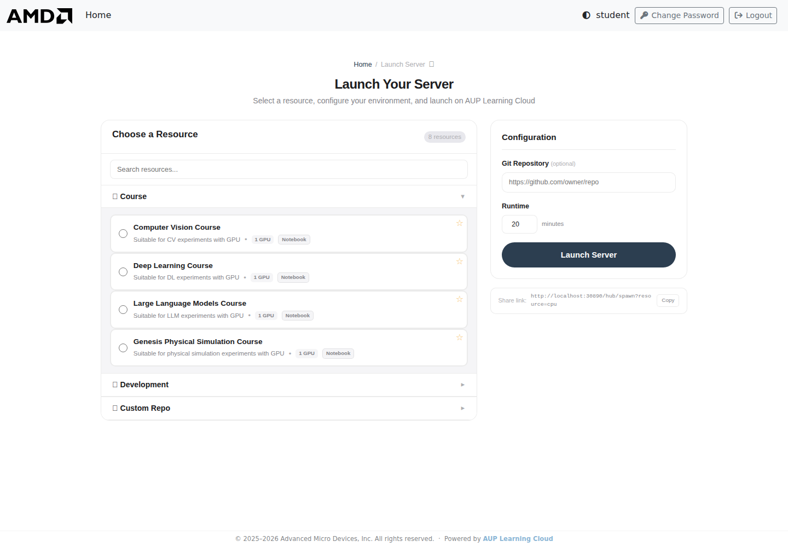
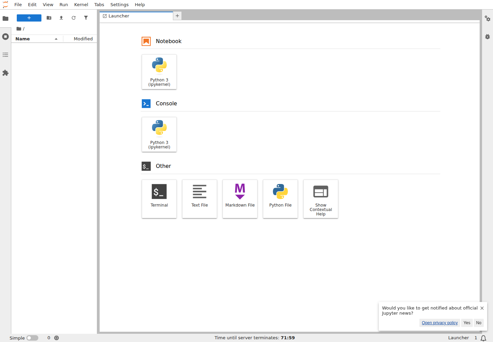

# JupyterLab Guide

This guide explains how to use the JupyterLab environment in AUP Learning Cloud for notebooks, Python experiments, course materials, and terminal access.

For login, environment selection, storage, and stopping servers, start with [Platform Basics](platform-basics.md).

## When To Use JupyterLab

Use JupyterLab when you want to:

- Run Jupyter notebooks for course labs
- Execute Python code interactively
- Read and modify course-provided notebooks
- Use a terminal for simple commands
- Save experiment results in your user directory

If you need a full VS Code-style IDE, use [Code Server Guide](code-server-guide.md) instead.

## Start A JupyterLab Environment

1. Sign in to AUP Learning Cloud.
2. Select a course, tutorial, test, or notebook environment.
3. Choose CPU or GPU resources if options are available.
4. Choose the runtime duration.
5. Click **Launch Server**.
6. Wait for the browser to open JupyterLab.



## Create A Notebook

1. In the Launcher page, choose **Python 3**.
2. A new notebook opens in the main work area.
3. Type code in a cell.
4. Press `Shift + Enter` to run the cell.

Example:

```python
print("Hello, JupyterHub!")
```



## Run Notebook Cells

Common actions:

| Action | Shortcut |
|---|---|
| Run current cell | `Shift + Enter` |
| Save notebook | `Ctrl + S` on Windows/Linux, `Cmd + S` on macOS |
| Add a new cell | Use the notebook toolbar `+` button |
| Change cell type | Use the cell type dropdown in the toolbar |

Run notebook cells in order when the notebook depends on previous variables, imports, or setup steps.

## Use The File Browser

The file browser on the left side lets you open, rename, move, upload, and download files.

Recommended workflow:

1. Keep active course work in a clear folder.
2. Save assignments and personal results under `/home/jovyan`.
3. Download a backup if the work is important.

:::{warning}
Some course images use `/ryzers/notebooks` as the default working directory. Move important files to `/home/jovyan` before the environment stops.
:::

## Use The Terminal

JupyterLab includes a terminal for shell commands.

1. Open the Launcher page.
2. Click **Terminal**.
3. Run commands as needed.

Useful examples:

```bash
# Check the current directory
pwd

# List files
ls

# Copy important work to persistent storage
cp <file-or-directory-to-save> /home/jovyan/

# Check GPU status in GPU environments
rocm-smi
```

## Save And Exit

Before leaving JupyterLab:

1. Save all notebooks.
2. Copy important files to `/home/jovyan`.
3. Shut down long-running notebooks or terminal commands that you no longer need.
4. Return to the Hub control page and click **Stop my server**.

## Troubleshooting

### A notebook cell fails

Check for common issues first:

- Missing imports
- Typing mistakes
- Cells run out of order
- Missing files or wrong file paths
- Dependencies that were not installed

### The notebook appears stuck

- Check whether a cell is still running.
- Interrupt the kernel if needed.
- Restart the kernel if the session is in a bad state.
- Save important files before stopping the server.

### A file is missing after restart

Check `/home/jovyan` first. Files that were only kept in temporary directories or default image directories may not persist.
