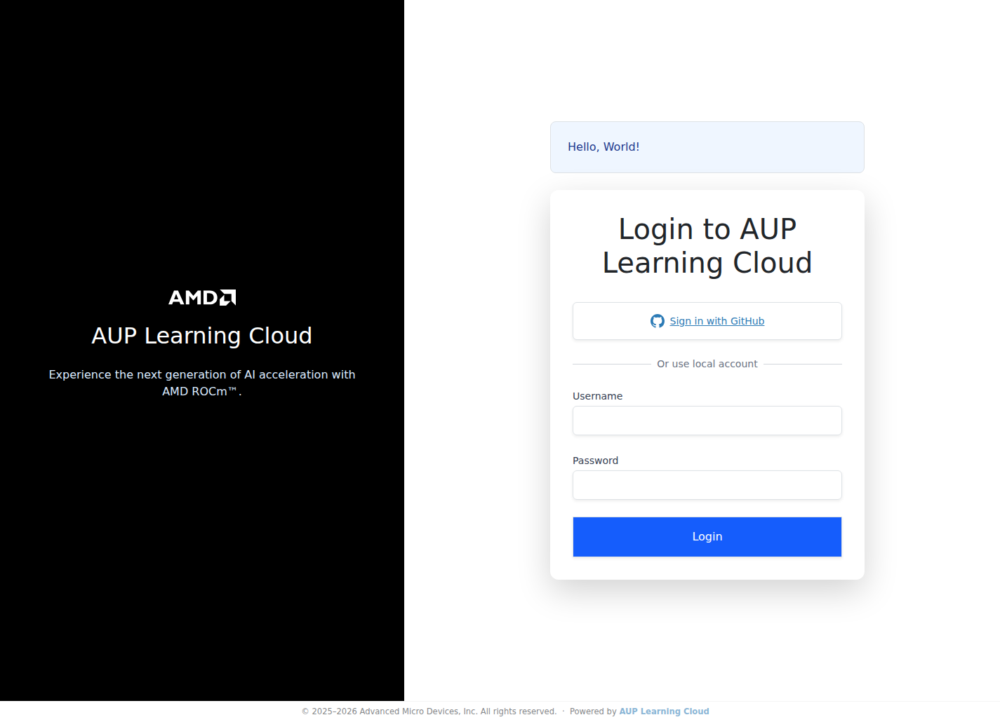
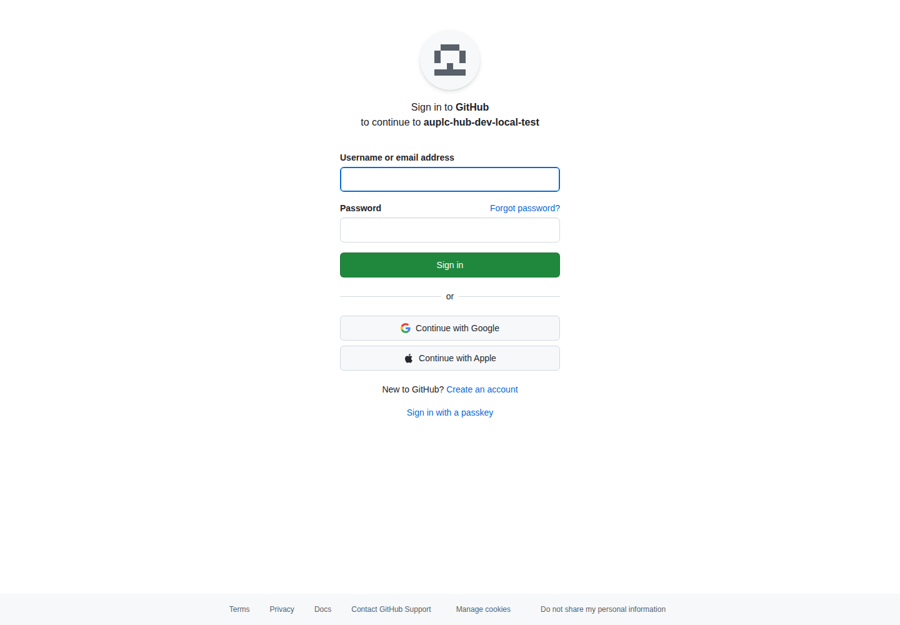
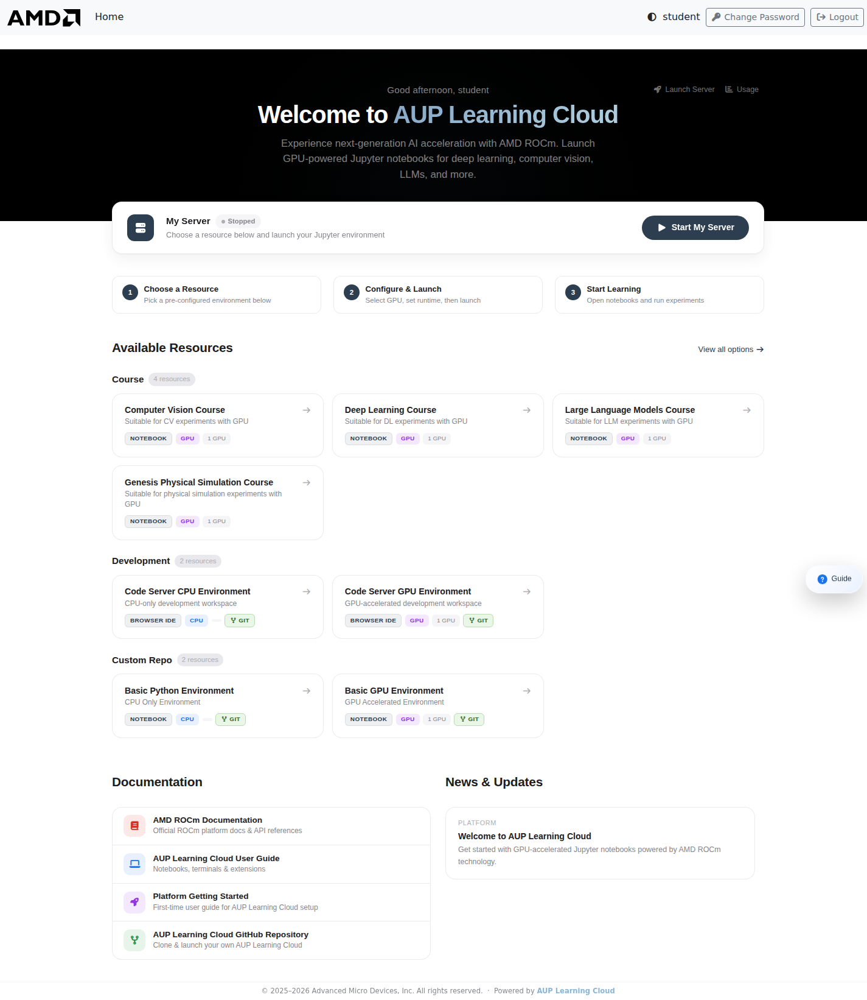
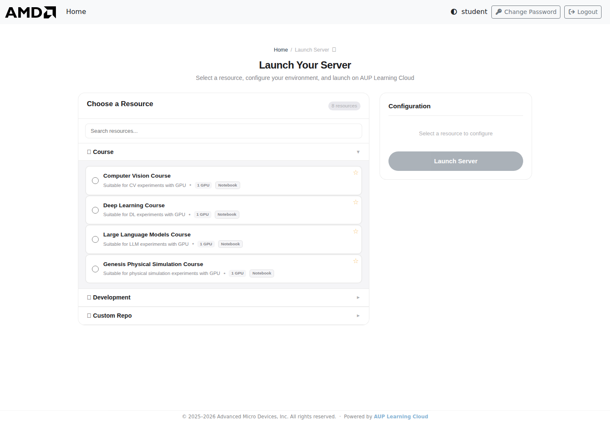
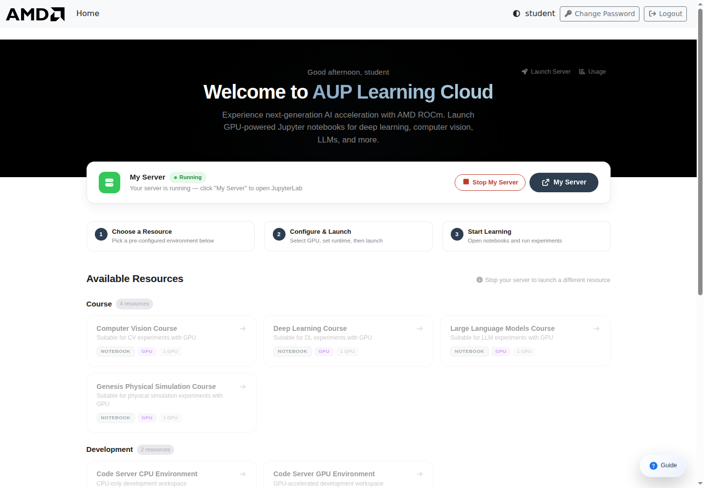

# Platform Basics

This guide covers the basic AUP Learning Cloud workflow: signing in, choosing an environment, understanding storage, and stopping your server when you are done.

For environment-specific usage, see [JupyterLab Guide](jupyterlab-guide.md) and [Code Server Guide](code-server-guide.md).

## What AUP Learning Cloud Provides

AUP Learning Cloud is a browser-based remote learning and development platform. You can use course environments, notebooks, terminals, GPU-enabled runtimes, and browser-based IDE sessions without configuring the full software stack on your local computer.

You need:

- A computer with network access
- A modern browser such as Chrome, Edge, or Firefox
- A GitHub-authorized account or a local platform account

## Open The Platform

Open the platform URL in your browser:

```text
https://www.openhw.io/
```

<!-- TODO: Add screenshot of the platform login page. -->
<!--  -->

## Sign In

The platform can provide two login methods. Your administrator will tell you which one to use.

| Login method | When to use it |
|---|---|
| GitHub login | Recommended when your GitHub account has been authorized for the course or lab. |
| Local account login | Use this when an administrator has created a username and password for you. |

### GitHub Login

1. Click **Use GitHub Login**.
2. The browser redirects to GitHub.
3. Select the authorized GitHub account.
4. Approve the authorization request.
5. After authorization, the browser returns to AUP Learning Cloud.

<!-- TODO: Add screenshot of GitHub login and authorization. -->
<!--  -->

### Local Account Login

If you need a local account, ask the administrator for access. The administrator will provide your username and initial password.

1. Enter your username and password on the login page.
2. Click **Use LocalAccount Login**.
3. If prompted, change your initial password before continuing.

If you forget your local account password, contact the administrator.

## Choose An Environment

After login, the platform shows a resource selection page. The exact list depends on your course, account permissions, and available hardware.

<!-- TODO: Add screenshot of the resource selection page. -->
<!--  -->

Common resource categories include:

| Category | Examples | Typical use |
|---|---|---|
| Course | Computer Vision, Deep Learning, Large Language Models, HIP Programming, Genesis Physical Simulation | Course notebooks and lab materials |
| Development | Code Server CPU Environment, Code Server GPU Environment | General coding, IDE workflow, terminal tasks |
| Test | HIP and ROCm Notebook Test | Environment validation and quick tests |
| Tutorial | Introduction to HIP | Guided tutorial content |
| Custom Repo | Basic Python Environment, Basic GPU Environment | Custom repository or base-image work |

## Launch A Server

1. Select the environment you want to use.
2. Select hardware resources, such as CPU or GPU, if options are shown.
3. Choose the runtime duration.
4. Click **Launch Server**.
5. Wait for the server to start.
6. The browser opens the selected interface, such as JupyterLab or Code Server.

<!-- TODO: Add screenshot of runtime duration and Launch Server controls. -->
<!--  -->

:::{important}
When the runtime duration expires, the platform may stop the server. Files that are not saved in the persistent user directory can be lost.
:::

## Save Important Files

Pay close attention to where your files are stored.

| Path | Purpose |
|---|---|
| `/ryzers/notebooks` | Default working directory in many images. It is useful for course materials, but content may be reset when the environment stops or changes. |
| `/home/jovyan` | Persistent user directory. Save important work, assignments, notebooks, and results here. |

If you created files in the default working directory and want to keep them, copy them to `/home/jovyan` before stopping the server:

```bash
bash
cp <file-or-directory-to-save> /home/jovyan/
```

:::{warning}
Do not rely on the default working directory for important work. Use `/home/jovyan` for files you need after the current session ends.
:::

## Stop Your Server

When you finish working, stop your server to release shared resources.

1. Save your notebooks, code, and output files.
2. Confirm important files are in `/home/jovyan`.
3. Return to the JupyterHub control page.
4. Click **Stop my server**.
5. Wait until the server has stopped before closing the browser tab.

<!-- TODO: Add screenshot of the Stop my server button. -->
<!--  -->

:::{important}
Closing the browser tab or logging out does not always stop the remote server. Use **Stop my server** when you are done.
:::

## Common Issues

### The page does not open or loads slowly

- Check your network connection.
- Refresh the page.
- Try Chrome, Edge, or Firefox.
- Contact the administrator if the platform is still unavailable.

### I already started one environment and want to switch

Stop the current server first by clicking **Stop my server**. Then return to the resource selection page and launch the new environment.

### My files disappeared after restart

Check whether the files were saved under `/home/jovyan`. Files kept only in a temporary or image-provided working directory may be reset after a server stop, timeout, or image change.

## Good Practices

- Save work frequently.
- Keep important files in `/home/jovyan`.
- Use clear file names instead of generic names such as `test.ipynb`.
- Split large experiments into separate notebooks or scripts.
- Stop your server when you are not using it.
- When asking for help, include the environment name, error message, and steps you tried.
